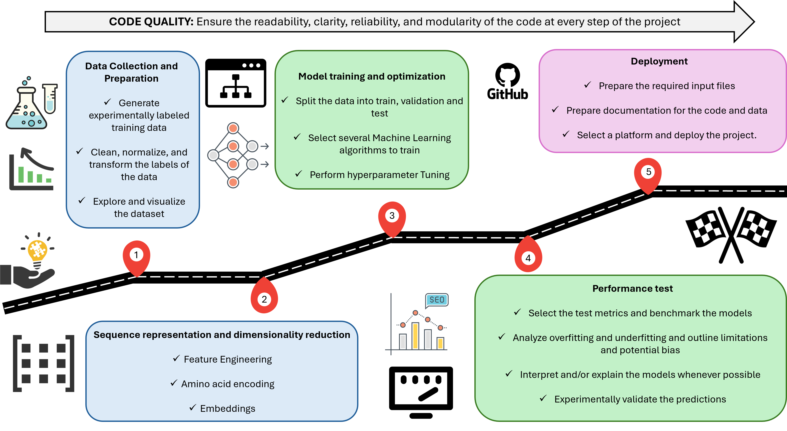

# Protein Engineering Code Center

This repository contain a guide to perform Machine Learning guided protein engineering. The resources comprised in this repository include tutorials, reusable code, and links to external resources, like some useful python libraries. 



## Prerequisites
- **Git** installed on your system. [Download Git here](https://git-scm.com/downloads).
- **Anaconda** or **Miniconda** for environment management. [Download here](https://docs.conda.io/en/latest/miniconda.html).
- SSH key configured for your GitHub account. [GitHub SSH setup guide](https://docs.github.com/en/authentication/connecting-to-github-with-ssh).

---

## Installation Steps

### 1. Clone the Repository (SSH)
Open a terminal and run:
```bash
git clone git@github.com:FabioHerrera97/Protein_Engineering_Code_Center.git
cd Protein_Engineering_Code_Center
```
### 2. Set Up the Conda Environment

The repository includes a YAML file (environment.yml) to recreate the required environment. Run:

```bash
conda env create -f environment.yml
```
### 3. Activate the Environment

```bash
conda activate ProteinEngineering
```

### Support

For issues or questions, please open an [Issue](https://github.com/FabioHerrera97/Protein_Engineering_Code_Center/issues) on GitHub.

### Useful Resources

#### Python coding

1. [Python PEP 8 Documentation](https://peps.python.org/pep-0008/#class-names)

PEP 8 is the definitive style guide for writing clean, readable, and consistent Python code. It includes key aspects such as code layout, naming conventions, readability practices, comments and docstrings and anti-patterns to avoid. 

2. [Real Python Article](https://realpython.com/python-code-quality/)

This guide explores essential practices and tools to improve readability, maintainability, and robustness of Python code. Key topics include Code Quality Fundamental Definitions ; Static Analysis Tools such as Linters, formatters, and type checkers; and testing and debugging tools such as Unit testing (pytest), debuggers, and profiling tools.

#### Machine Learning

3. [Google Best Practices for ML Engineering](https://developers.google.com/machine-learning/guides/rules-of-ml)

This guide is designed for practitioners with foundational machine learning experience who want to adopt Google’s proven methodologies. It outlines practical ML development standards, akin to widely used programming style guides.

4. [Scikit-Learn](https://scikit-learn.org/stable/user_guide.html)

The official Scikit-learn User Guide provides comprehensive documentation for Python's premier machine learning library. It contains progressive tutorials from basic to advanced ML concepts and clear explanations of algorithms with mathematical foundations as well as code examples for all major ML tasks (classification, regression, clustering).

5. [TorchProtein](https://torchprotein.ai/)

TorchProtein is an open source library for protein representation learning. It encapsulates common protein machine learning demands in human-friendly data structures, models and tasks, to ease the process of building applications on proteins.

6. [DeepMind Nuclease Design](https://github.com/google-deepmind/nuclease_design)

TorchProtein is an open source library for protein representation learning. It encapsulates common protein machine learning demands in human-friendly data structures, models and tasks, to ease the process of building applications on proteins.


